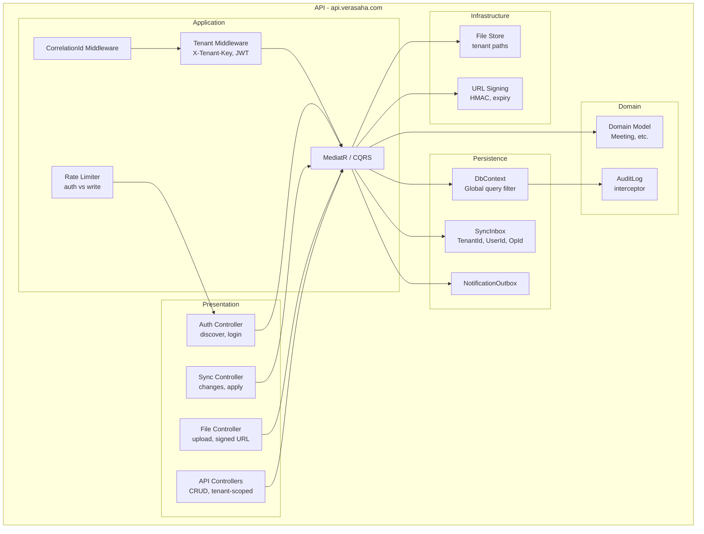

# Component View — API (English)

C4 Level 3: Main components inside the API container. Mermaid.

---

## Diagram

---

## Components (concise)

- **Presentation:** Auth (discover, login), Sync (changes, apply), File (upload, signed URL), API CRUD; all tenant-scoped where applicable.
- **Middleware:** CorrelationId; Tenant resolution (X-Tenant-Key) and JWT tenant binding; rate limiting (auth vs write).
- **Application:** MediatR/CQRS; use cases orchestrate domain and persistence.
- **Domain:** Aggregates (e.g. Meeting); AuditLog via SaveChanges interceptor.
- **Persistence:** DbContext with global TenantId filter; SyncInbox (idempotency); NotificationOutbox.
- **Infrastructure:** File store (tenant paths); signed URL generation (HMAC, expiry) for CDN.
