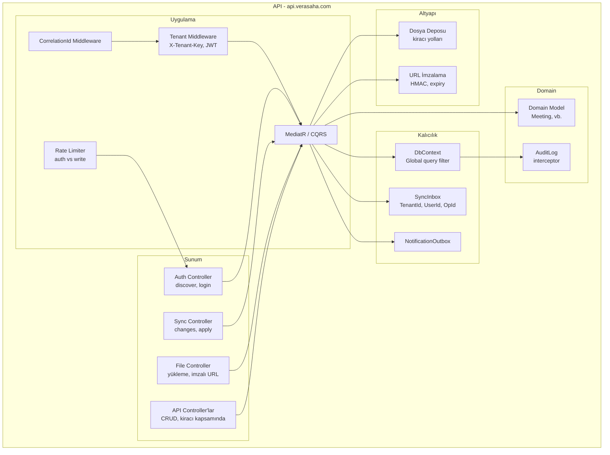

# Bileşen Görünümü — API (Türkçe)

C4 Seviye 3: API konteyneri içindeki ana bileşenler. Mermaid.

---

## Diyagram

---

## Bileşenler (kısa)

- **Sunum:** Auth (discover, login), Sync (changes, apply), File (yükleme, imzalı URL), API CRUD; uygulanabilir yerde kiracı kapsamında.
- **Middleware:** CorrelationId; Kiracı çözümleme (X-Tenant-Key) ve JWT tenant bağlama; rate limiting (auth vs write).
- **Uygulama:** MediatR/CQRS; use case’ler domain ve kalıcılığı orkestre eder.
- **Domain:** Aggregate’ler (örn. Meeting); SaveChanges interceptor ile AuditLog.
- **Kalıcılık:** Global TenantId filter’lı DbContext; SyncInbox (idempotency); NotificationOutbox.
- **Altyapı:** Dosya deposu (kiracı yolları); CDN için imzalı URL üretimi (HMAC, expiry).
