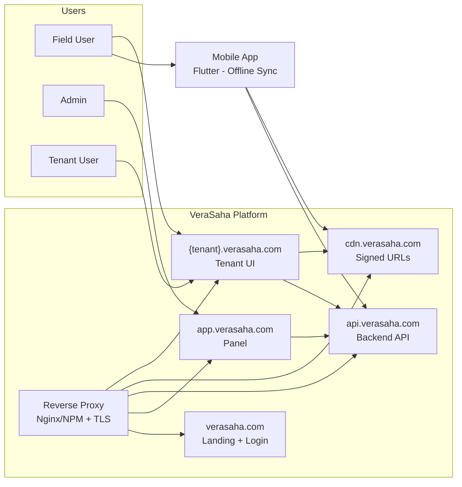

# System Context — VeraSaha (English)

C4 Level 1: System Context. Text diagram using Mermaid.

---

## Diagram

---

## Elements

- **Users:** Field user (mobile + tenant UI), admin (panel), tenant user (browser).
- **Reverse proxy:** Nginx or NPM; TLS termination; routes by host to landing, app, API, CDN, tenant UI.
- **Landing:** verasaha.com — discovery and login entry.
- **Panel:** app.verasaha.com — admin/management.
- **Backend API:** api.verasaha.com — single API; X-Tenant-Key + JWT.
- **CDN:** cdn.verasaha.com — file serving via signed URLs only.
- **Tenant UI:** {tenant}.verasaha.com — tenant-specific web UI.
- **Mobile:** Flutter client; offline-first; sync with API.
