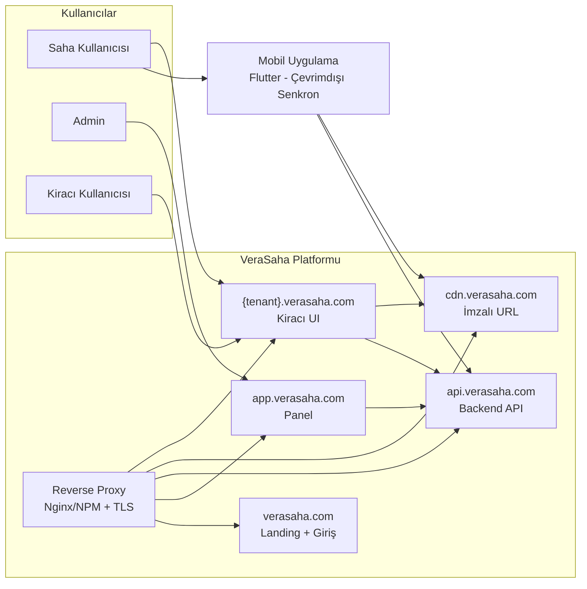

# Sistem Bağlamı — VeraSaha (Türkçe)

C4 Seviye 1: Sistem bağlamı. Mermaid ile metin diyagramı.

---

## Diyagram

---

## Öğeler

- **Kullanıcılar:** Saha kullanıcısı (mobil + kiracı UI), admin (panel), kiracı kullanıcısı (tarayıcı).
- **Reverse proxy:** Nginx veya NPM; TLS sonlandırma; host’a göre landing, app, API, CDN, kiracı UI’a yönlendirme.
- **Landing:** verasaha.com — keşif ve giriş noktası.
- **Panel:** app.verasaha.com — yönetim.
- **Backend API:** api.verasaha.com — tek API; X-Tenant-Key + JWT.
- **CDN:** cdn.verasaha.com — yalnızca imzalı URL ile dosya sunumu.
- **Kiracı UI:** {tenant}.verasaha.com — kiracıya özel web arayüzü.
- **Mobil:** Flutter istemcisi; çevrimdışı öncelikli; API ile senkron.
